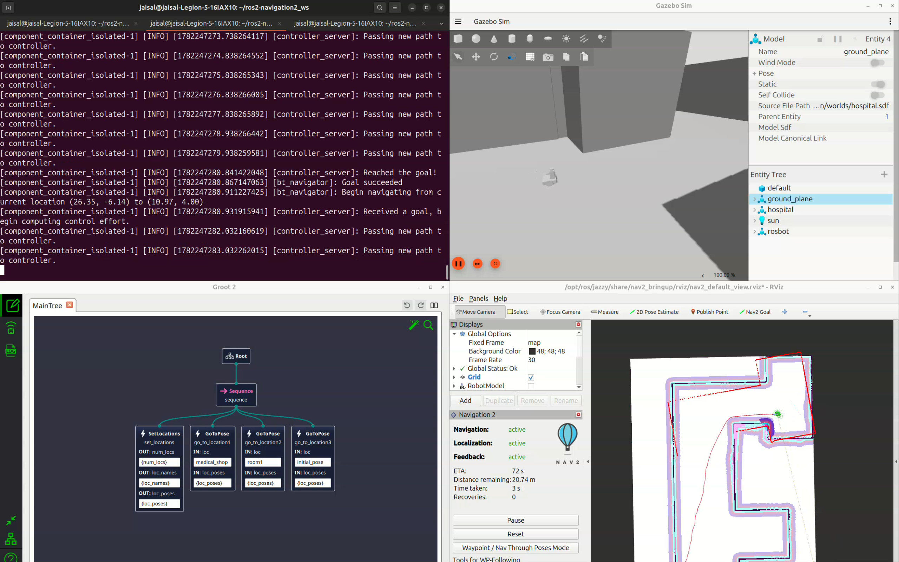
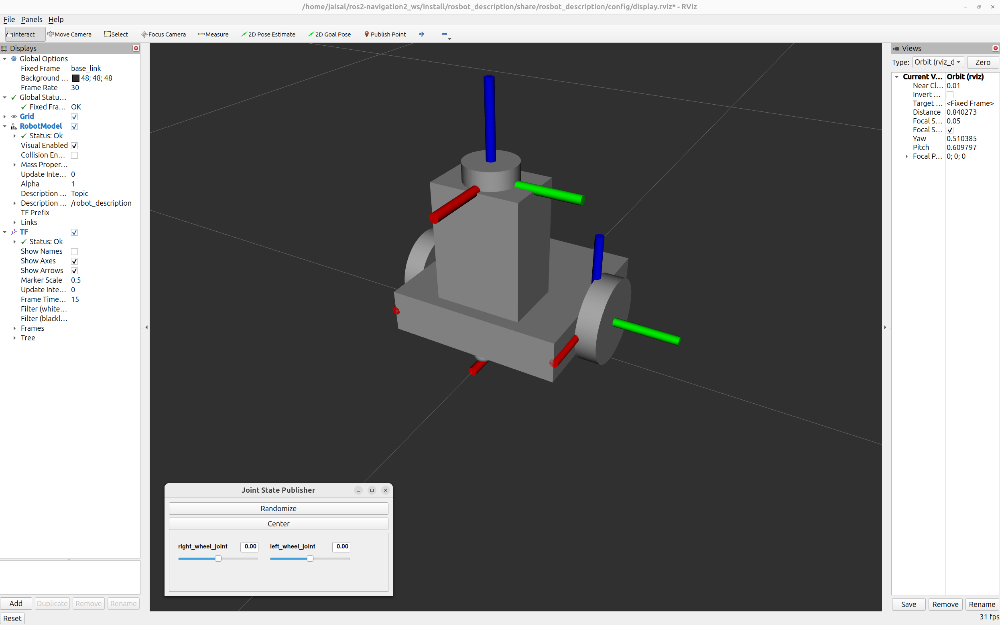
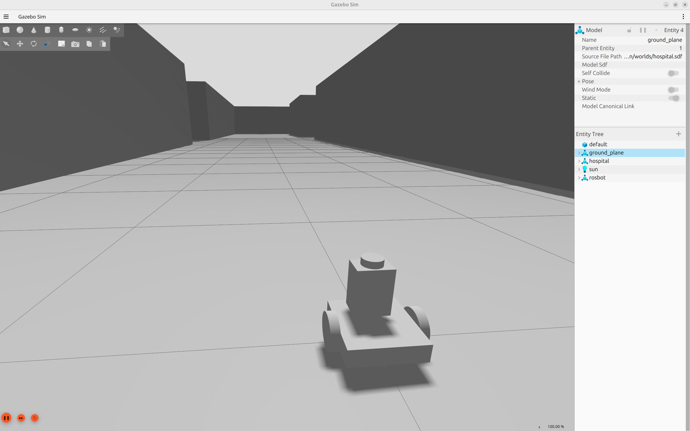
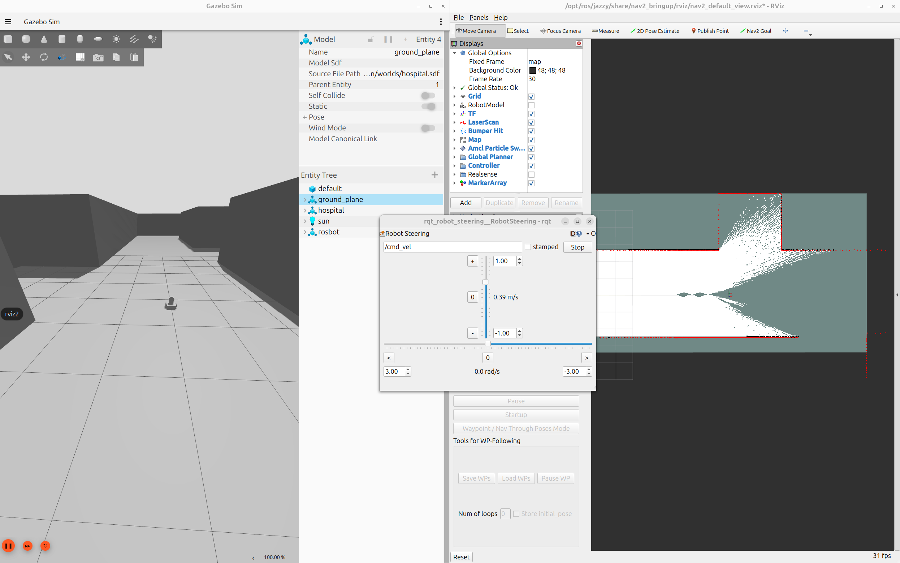
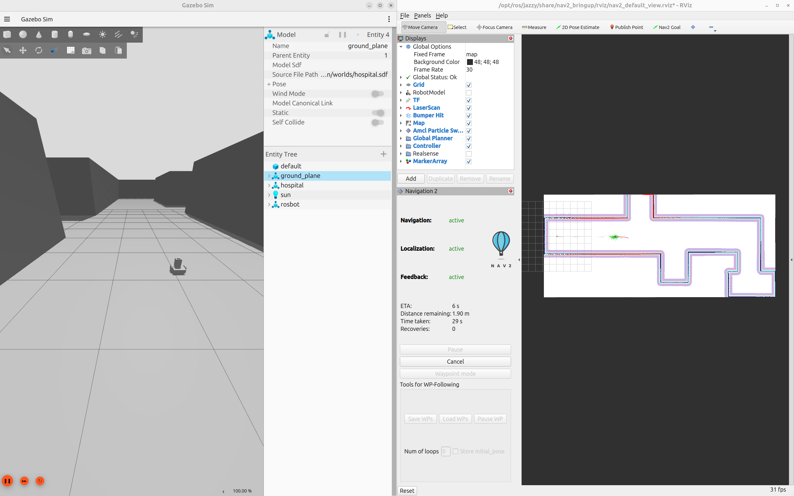
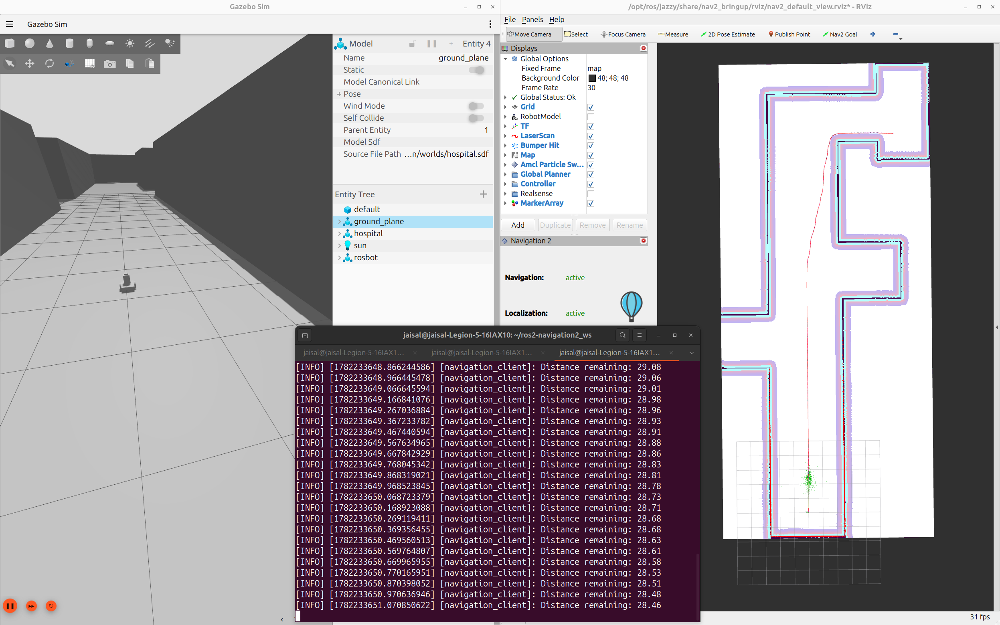
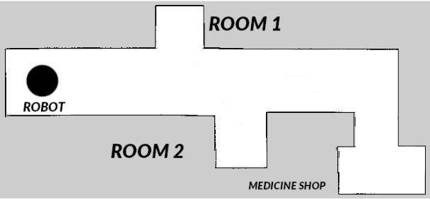

# ROS 2 Autonomous Navigation Stack for ROSbot

<p align="center">
  
</p>

A complete autonomous navigation system built using **ROS 2 Jazzy**, **Nav2**, **SLAM Toolbox**, **Gazebo**, and **Behavior Trees**.

This project demonstrates:

- Robot modeling and visualization
- Gazebo simulation
- 2D SLAM mapping
- Autonomous navigation with Nav2
- Goal-based navigation
- Custom Nav2 applications
- Behavior Tree based task execution
- Groot2 integration for BT visualization

---

## Prerequisites

```bash
sudo apt install ros-jazzy-navigation2 ros-jazzy-nav2-bringup ros-jazzy-slam-toolbox
```

## Packages

| Package               | Description                                            |
| --------------------- | ------------------------------------------------------ |
| `rosbot_description`  | ROSbot URDF, RViz visualization, and Gazebo simulation |
| `rosbot_nav2_bringup` | Nav2 and SLAM Toolbox configuration                    |
| `nav2_client`         | Custom C++ Nav2 action client                          |
| `nav2_bt_client`      | Behavior Tree based navigation application             |

---

## Build

```bash
cd ~/ros2-navigation2_ws

source /opt/ros/jazzy/setup.bash

colcon build --symlink-install

source install/setup.bash
```

---

# 1. Robot Model Visualization

Launch the ROSbot model in RViz.

```bash
source ~/ros2-navigation2_ws/install/setup.bash

ros2 launch rosbot_description display.launch.py
```

### Result

<p align="center">
  
</p>

---

# 2. Gazebo Simulation

Launch the robot inside the Gazebo simulation environment.

```bash
source ~/ros2-navigation2_ws/install/setup.bash

ros2 launch rosbot_description gazebo.launch.py
```

- Simulation world loads
- ROSbot spawns in Gazebo
- Sensors and robot controllers become active

### Result

<p align="center">
  
</p>

---

# 3. SLAM Mapping

Generate a 2D occupancy grid map using SLAM Toolbox.

### Terminal 1

```bash
ros2 launch rosbot_description gazebo.launch.py
```

### Terminal 2

```bash
ros2 launch rosbot_nav2_bringup slam_online_async.launch.py
```

Drive the robot around the environment to build the map.

### Save Map

```bash
ros2 run nav2_map_server map_saver_cli -f ~/map
```

### Result

<p align="center">
  
</p>

---

# 4. Goal-Based Navigation

Perform autonomous navigation using Nav2.

### Terminal 1

```bash
ros2 launch rosbot_description gazebo.launch.py
```

### Terminal 2

```bash
ros2 launch rosbot_nav2_bringup nav2.launch.py
```

### Steps

1. Set the robot's initial pose using **2D Pose Estimate**
2. Select **Nav2 Goal**
3. Send a navigation target

### Result

<p align="center">
  
</p>

---

# 5. NavigateToPose Action Client

Run a custom C++ Nav2 action client.

### Terminal 1

```bash
ros2 launch rosbot_description gazebo.launch.py
```

### Terminal 2

```bash
ros2 launch rosbot_nav2_bringup nav2.launch.py
```

### Terminal 3

```bash
ros2 run nav2_client navigation_client
```

The application communicates with Nav2 using the `NavigateToPose` action interface.

### Result

<p align="center">
  
</p>

---

## Navigation Scenario

The robot must autonomously visit multiple locations inside a hospital environment.

<p align="center">
  
</p>

Navigation sequence:

1. Start position
2. Medicine Shop
3. Room 1
4. Return to Initial Pose

---

# 6. Behavior Tree Task Execution

Execute navigation tasks using a Behavior Tree based workflow.

### Terminal 1

```bash
ros2 launch rosbot_description gazebo.launch.py
```

### Terminal 2

```bash
ros2 launch rosbot_nav2_bringup nav2.launch.py
```

Set the robot's initial pose using **2D Pose Estimate**.

### Terminal 3

```bash
ros2 launch nav2_bt_client start_bt_app.launch.py
```

This launches:

- Nav2 BT Action Client
- Groot2
- Behavior Tree execution engine
- Real-time navigation monitoring
- Robot navigation inside the environment

### Result

<p align="center">
  
</p>

## Demo Video

https://github.com/user-attachments/assets/565b6487-86c9-47bc-9a04-d35003d8cbc9

---

## Technologies Used

- ROS 2 Jazzy
- Navigation2 (Nav2)
- SLAM Toolbox
- Gazebo Sim
- RViz2
- BehaviorTree.CPP
- Groot2
- C++
- URDF

---

## Repository Structure

```text
src/
├── rosbot_description
├── rosbot_nav2_bringup
├── nav2_client
└── nav2_bt_client
```

## Navigation Workflow

1. Robot Model
2. Simulation
3. Mapping
4. Localization
5. Path Planning
6. Autonomous Navigation
7. Behavior Tree Task Execution
